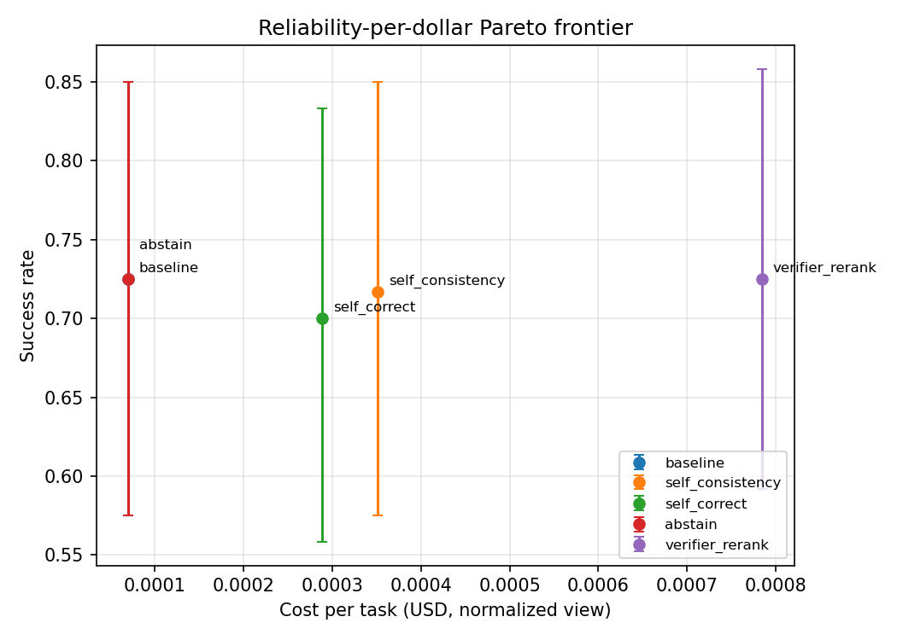

# The Reliability Tax

**How much reliability does inference actually buy for tool-use LLM agents?**

People make agents more reliable by spending inference: sample a few times and vote, let the model
critique and retry, add a verifier, abstain when unsure. All of it costs tokens and latency. I
wanted to know the exchange rate, so I measured it.

This repo is a small framework plus the study I ran with it. It runs the same set of reliability
strategies over a tool-use benchmark on a self-hosted vLLM model, and reports success per dollar
with confidence intervals and multiple seeds.

The short version: on programmatic tool-use, none of the strategies beat a single greedy pass,
and they cost 5–11x more. The reason isn't a bug. The model is near-deterministic on function
calling (all 5 samples were identical in 98 of 120 task-seeds), so there's nothing for sampling
or voting to work with. What inference can buy depends on the error structure, not just the budget.

I spent about **$0.70 of a $30 cap** getting here. Every number below is labeled REAL (self-hosted
Qwen2.5) or MOCK (a deterministic fake model I used to build the pipeline for $0 before touching a
GPU). I kept both because the contrast is part of the point.

## Results

Two real runs on self-hosted Qwen2.5, plus a multi-turn integration.

**Qwen2.5-1.5B, BFCL `simple_python`, 40 tasks x 3 seeds (~$0.06).** The baseline is already strong,
so there's almost nothing to win:

| strategy | success | 95% CI | calls/task | reliability/$ (norm) |
|---|---|---|---|---|
| baseline | 0.825 | [0.70, 0.93] | 1.0 | 18,025 |
| abstain | 0.825 | [0.70, 0.93] | 1.0 | 18,025 |
| self_correct | 0.817 | [0.69, 0.93] | 2.0 | 8,069 |
| self_consistency | 0.842 | [0.72, 0.94] | 5.0 | 3,677 |
| verifier_rerank | 0.842 | [0.72, 0.94] | 10.0 | 1,642 |

**Qwen2.5-7B, BFCL `parallel_multiple`, 40 tasks x 3 seeds (~$0.12).** This one has real headroom
(baseline 0.725, not saturated), which is where I expected the strategies to earn their cost. They
didn't:



| strategy | success | 95% CI | calls/task | tok/task |
|---|---|---|---|---|
| baseline | 0.725 | [0.57, 0.85] | 1.0 | 270 |
| abstain | 0.725 | [0.57, 0.85] | 1.0 | 270 |
| verifier_rerank | 0.725 | [0.59, 0.86] | 10.0 | 3,109 |
| self_consistency | 0.717 | [0.57, 0.85] | 5.0 | 1,354 |
| self_correct | 0.700 | [0.56, 0.83] | 3.1 | 1,148 |

Every strategy is at or below baseline for 3–10x the cost. The Pareto frontier is a single point.

### Why nothing helps (and how I know it's not just broken code)

The obvious worry with a negative result is that I implemented the strategies wrong. I don't think
so — the mechanism shows up directly in the logs:

- **The model barely varies on function calling.** Across 120 task-seeds of self_consistency (5
  samples at temp 0.7), all five were identical in 98 of them. Mean unique answers: 1.24 out of 5.
  Majority voting has nothing to vote over, so it collapses to baseline.
- **pass@k is flat.** verifier_rerank only moves 0.725 → 0.75 going to k=3. Low output diversity
  means sampling surfaces very few new correct answers.
- **`abstain` never fires.** Logprobs stay high (Phase 2 mean −0.06, all above the −0.8 threshold).
  The model is confident, so a confidence gate does nothing.

So the strategies pay off when a model's correct answers are reachable through diverse, stochastic
outputs — which is the regime the mock model fakes, and where the plots below do separate. Real
function calling is the opposite: the model commits to one answer, right or wrong, and paying 10x
to sample around it changes little.

Figures: [`results/figures_phase2/`](results/figures_phase2) (1.5B),
[`results/figures_phase3/`](results/figures_phase3) (7B),
[`results/figures/`](results/figures) (mock).

### tau-bench (multi-turn): integration works, model too weak

The headline was supposed to be tau-bench airline ("agent books a flight"). I built the full
integration — tau-bench's `Env` for tasks/tools/reward, my own per-turn action loop driving the
strategies, and an instrumented user-simulator so both agent and user-sim calls get counted. It
runs correctly (the 7B uses IATA codes, nests tool args properly, holds a coherent conversation —
see [`results/taubench_airline_7b_transcripts.txt`](results/taubench_airline_7b_transcripts.txt)),
but airline is hard (GPT-4 lands ~35–50%) and the 7B scores 0, so it can't separate strategies.
I'm keeping it as a third data point: when there's no latent capability at all, no strategy helps
either. Full quantitative tau-bench needs a stronger model — that's future work.

## The strategies (`src/strategies/`)

Common interface: `run(task, model_client, *, seed) -> TaskResult`, recording every model call so
the cost accounting is honest.

| strategy | idea | calls/task |
|---|---|---|
| `baseline` | single greedy pass | 1 |
| `self_consistency` | sample n, majority vote | n |
| `self_correct` | act, critique, revise | 1 + 2·iters |
| `abstain` | answer, but escalate when mean logprob is low | 1 |
| `verifier_rerank` | generate n, score with the same model as verifier, pick best | 2n |

Two rules keep it from cheating: success comes only from the benchmark checker, never from a
strategy grading itself, and `verifier_rerank` ranks by the model's own score, not the ground-truth
checker (no oracle reranking). An abstention costs money but doesn't count as solved.

## Cost, measured two ways (`src/cost.py`, `src/instrument.py`)

Per task I log prompt/completion tokens, wall-clock, TTFT (streamed), and call count. There are two
dollar figures and I keep them separate on purpose:

1. **Measured Modal GPU-time** — the real bill. GPU-seconds times the per-second rate. Depends on
   your batching and cold starts; doesn't generalize.
2. **Normalized reference-token** — tokens times a published per-token price. Generalizes, but
   ignores throughput.

These can differ by an order of magnitude, because self-hosting spreads a fixed GPU rental over
however many tokens you push through it. I report both. See `BUDGET.md` for the reconciliation.

## Metrics (`src/metrics.py`)

- pass@1 and pass@k via the unbiased Chen et al. (2021) estimator.
- reliability-per-dollar = successful tasks ÷ cost, plus marginal cost per extra success vs baseline.
- bootstrap 95% CIs (resampling over tasks), at least 3 seeds, matched task sets across strategies.

The mock plots ([`results/figures/`](results/figures)) show the pass@1-vs-pass@k gap and the
compounding-error curve clearly because the mock idealizes errors as stochastic. They're labeled
MOCK throughout — don't read them as claims about Qwen.

## Quickstart (the $0 mock pipeline)

No GPU, no network, no secrets.

```bash
pip install -e .

python scripts/run_eval.py --benchmark mock --model mock --strategies all \
    --seeds 0 1 2 3 4 --n-tasks 40

python scripts/make_plots.py --run 'results/run_mock_mock_*.json' \
    --outdir results/figures --pass-at-k-strategy self_consistency
```

### Running a real model (costs money — read BUDGET.md first)

```bash
modal deploy modal_app.py

# always dry-run first to print a cost projection
python scripts/run_eval.py --benchmark bfcl --bfcl-data data/bfcl --bfcl-categories simple_python \
    --model Qwen/Qwen2.5-1.5B-Instruct --base-url https://<app>.modal.run/v1 \
    --strategies all --seeds 0 1 2 --n-tasks 40 --gpu L4 --budget 5 --dry-run

# then smoke-test ~5 tasks
python scripts/smoke_test.py --base-url https://<app>.modal.run/v1 \
    --model Qwen/Qwen2.5-1.5B-Instruct --bfcl-data data/bfcl --bfcl-categories simple_python
```

`--budget` is a hard kill-switch: `run_eval.py` refuses to start if the projection exceeds it, and
the harness aborts mid-run if measured cost goes over.

## Benchmarks (`src/benchmarks/`)

Pluggable via an adapter interface.

- **`mock`** — synthetic tasks with per-task difficulty; powers the $0 pipeline.
- **`bfcl`** — Berkeley Function-Calling Leaderboard. Single-turn categories use cheap AST checking.
  Multi-turn here is a conservative structural check, *not* BFCL's official stateful-backend scorer,
  so don't quote its multi-turn numbers as official BFCL accuracy.
- **`tau-bench`** (`src/agentic/`) — real tau-bench `Env` (tasks, tool execution, DB-state reward),
  driven by my own action loop with an instrumented user-sim. Validated by oracle replay (reward
  1.0); the 7B scores 0 on airline, so it's a qualitative deliverable for now.

## Repo map

```
modal_app.py            vLLM OpenAI server on Modal (cached weights, scale-to-zero)
src/
  harness.py            strategy x task x seed on matched sets; concurrency; budget kill-switch
  strategies/           baseline, self_consistency, self_correct, abstain, verifier_rerank
  agentic/              multi-turn: per-turn policies + tau-bench Env integration
  benchmarks/           adapter interface + mock + BFCL + tau-bench
  instrument.py         per-call tokens / wall-clock / TTFT / call-count
  cost.py               the two cost views
  metrics.py            pass@k, bootstrap CIs, reliability-per-dollar
  mock_model.py         deterministic fake model for the $0 pipeline
scripts/                run_eval, run_taubench, smoke_test, make_plots, taubench_one
results/                run logs, figures, leaderboard, transcripts
tests/                  pass@k, end-to-end mock, BFCL checker, tau-bench
BUDGET.md               $ ledger + Modal pricing + per-phase reconciliations
```

## Things to know before trusting any of this

- **It's a negative result.** The strategies don't help *here* (programmatic tool-use, Qwen2.5).
  That's a real, CI-backed finding, not a claim they never help. The low-diversity mechanism tells
  you where they would.
- **Mock vs real.** The mock idealizes errors as stochastic, so its plots separate. Useful as a $0
  rehearsal and as contrast; never read mock figures as claims about Qwen.
- **The cost gap is real.** Per-request attribution captures only steady-state inference. The actual
  Modal bill is dominated by cold start (~150s to load + compile the 1.5B). In the smoke test these
  differed by ~40–80x. Ground truth is the Modal dashboard; reconciled in `BUDGET.md`.
- **My BFCL checker isn't the official one.** It's a lightweight AST reimplementation. The smoke
  test caught it under-counting ~4x (it ignored positional args and names like `math.factorial`);
  fixed and regression-tested, but it still won't match official BFCL exactly. Use it for matched
  cross-strategy comparison, not as a leaderboard score.
- **Small samples, one model family.** 30–50 tasks, so CIs are wide. Qwen2.5 only. I report the
  uncertainty rather than hiding it.

## Future work

- Find the regime where the strategies *do* pay — high-diversity, stochastic-error tasks
  (open-ended reasoning, code with many valid solutions). The data predicts it; sweep temperature
  and correlate vote-entropy with strategy lift to confirm.
- Re-run tau-bench with a capable model so airline/retail produce non-zero rewards and the
  multi-turn compounding-error story lands.
- The whole thing is the inference-time echo of "RL narrows rather than teaches." The training-time
  version is out of scope here (no training), but it's the obvious next question.

## Stack

Python 3.11+. numpy/pandas/matplotlib/pydantic/tenacity for the mock pipeline; openai + modal for
serving; vllm inside the Modal image. Models: Qwen2.5-1.5B-Instruct (dev/sweep) and
Qwen2.5-7B-Instruct (headline), both Apache-2.0. Serving is Modal + vLLM, weights cached in a
Volume, scale-to-zero. See `BUDGET.md` for pricing and cost-control settings.

## License

MIT — see [LICENSE](LICENSE).
